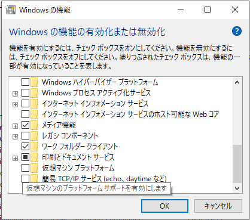

先日、VR使用を鑑みた新しいデスクトップPCを購入しました :sparkles:
そのためWindows上、最強のLinux環境を探していたのですが、思わぬところで詰まったので、メモしておきます。

## VMWare Playerで64bit OSをインストールするには、Intel-VTが必要

その詰まったところというのが、本稿のタイトルそのものであります。

その解決策は単純で、WSL2を無効にするだけです。
（下記は日本語設定の場合の操作です。）

1. 「Windowsの機能」アプリを開く
1. 「仮想マシンプラットフォーム」のチェックを外す

他の方法でWSL2を無効にしても、問題は解決するかもしれません。

## そもそも

そもそもIntel-VTというのは、あるソフトウェアが使用している間は専有されてしまって、他のソフトウェアが参照できなくなってしまうのが驚きでした。
（そういうことだよね……？？）

## その他、憶測

もしかしたらWSL1でも、Intel-VTを専有されるかもしれません。
その場合は、この操作で直るかと思います。

VMWare Playerを試す以前に、VirtualBox上のArchLinuxのインストールで、GPGキー周りがおかしくてうまく行かなかったのも、これが原因……？？

- - - - -

終わり。
